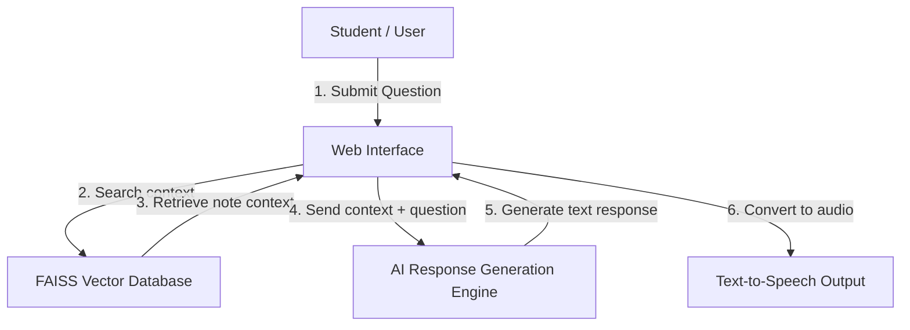
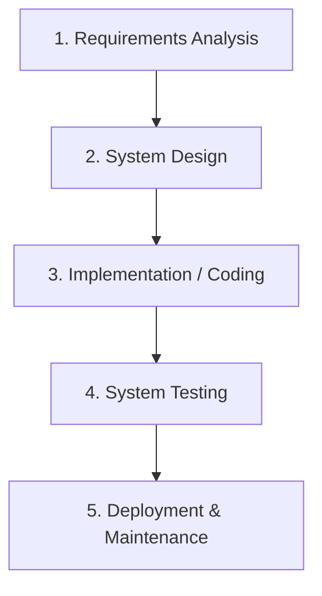

# FINAL YEAR PROJECT PROPOSAL

---

**KEMENTERIAN PENDIDIKAN TINGGI**  
**JABATAN PENDIDIKAN POLITEKNIK DAN KOLEJ KOMUNITI**  
**POLITEKNIK KUCHING SARAWAK**  

  

## AI-INTEGRATED LEARNING MANAGEMENT SYSTEM (LMS)

  

### PREPARED BY:
* **DANIEL WONG BIN HUSAIN WONG** (REG NO: [Insert Reg No])
* **[MEMBER 2 NAME]** (REG NO: [Insert Reg No])
* **[MEMBER 3 NAME]** (REG NO: [Insert Reg No])

 

### PREPARED FOR:
* **[SUPERVISOR'S NAME]**

  

**DIPLOMA IN INFORMATION TECHNOLOGY**  
**POLITEKNIK KUCHING SARAWAK**  
**SESSION I: 2026/2027**  

---

## TABLE OF CONTENTS

* **1.0 Introduction** .......................................................................................................... 1
* **2.0 Problem Statement** ................................................................................................... 2
* **3.0 Objectives** .......................................................................................................... 2
* **4.0 Scope** ............................................................................................................... 2
* **5.0 Project Significance** ................................................................................................. 3
* **6.0 Literature Review** .................................................................................................... 4
* **7.0 Methodology** ........................................................................................................ 5
* **8.0 References** ........................................................................................................... 6
* **9.0 Gantt Chart** .......................................................................................................... 7
* **10.0 Cost Planning** ...................................................................................................... 8
* **11.0 Conclusion** .......................................................................................................... 8

---

## 1.0 INTRODUCTION

The **AI-Integrated Learning Management System (LMS)** is a web-based learning platform developed to enhance the study experience of IT diploma students at Politeknik Kuching Sarawak. Traditional LMS platforms allow instructors to upload learning materials but lack interactive and adaptive tutoring systems, forcing students to manually search through lengthy lecture notes.

This proposed system implements a web-based AI assistant powered by **Retrieval-Augmented Generation (RAG)**. When a lecturer uploads course notes in PDF format, the AI processes and indexes the content. Students can then query the AI in real-time and receive immediate, context-grounded answers. In addition to text-based answers, the system provides voice response outputs that mimic the lecturer’s speaking style to increase student engagement. It also features an automated practice quiz generator for self-learning evaluation, and a hybrid fallback Q&A queue that routes unanswered queries directly to the lecturer's dashboard.

* **Figure 1:** AI-Integrated LMS System Architecture Flow

---

## 2.0 PROBLEM STATEMENT

* **Problem 1:** Students often spend a significant amount of time searching for specific information within lengthy lecture notes and learning materials.
* **Problem 2:** Lecturers are not always available to answer students' questions outside lecture hours, causing delays in the learning process.
* **Problem 3:** Existing LMS platforms mainly provide static learning materials and lack interactive features that allow students to receive immediate feedback and assistance.

## 3.0 OBJECTIVES

* **Objective 1:** To develop an AI-integrated LMS that enables students to ask questions and receive answers based on uploaded course notes.
* **Objective 2:** To provide voice response functionality to enhance student engagement and learning experience.
* **Objective 3:** To improve accessibility to learning resources by providing fast and accurate responses anytime and anywhere.

## 4.0 SCOPE

#### 4.1 System Scope
* **Lecture Note Ingestion:** The system parses PDF lecture notes, segments the text, and stores semantic embeddings in a local vector database.
* **RAG Chat Module:** Students submit questions through a chat interface, and the system retrieves the most relevant passage from the notes to synthesize a factual response.
* **Voice Synthesis (TTS):** The system converts generated text responses into high-quality audio outputs mimicking the lecturer's speaking voice.
* **Practice Question Builder:** Instructors or the system AI can automatically generate quizzes based on notes.
* **Fallback Queue & Scheduling:** A dashboard that stores questions the AI could not resolve, allowing the lecturer to respond during scheduled hours.

#### 4.2 User Scope
* **Students:** Access the chat interface, listen to speech responses, view note references, and complete generated practice quizzes.
* **Lecturers:** Upload PDF notes, set direct message timetable slots, review AI logs, and answer queued student questions.

## 5.0 PROJECT SIGNIFICANCE

* **Saves Student Study Time:** Rather than scrolling through dozens of PDF pages, students can ask questions and instantly get exact page references and explanations.
* **Reduces Lecturers' Repetitive Workload:** The AI clone answers common, repetitive questions, allowing lecturers to focus on resolving more complex academic issues.
* **Modernizes Polytechnic E-Learning:** Bridges the gap between static content distribution and interactive 4IR educational environments, enhancing student self-learning performance.

---

## 6.0 LITERATURE REVIEW

The proposed system addresses the limitations of both traditional LMS platforms and generalized public AI chatbots.

### Comparative Study of Platforms
| Features | Traditional LMS (e.g. SIDOS) | Public Chatbot (e.g. ChatGPT) | Proposed AI-Integrated LMS |
| :--- | :--- | :--- | :--- |
| **Source Context** | Static slides & notes. | General internet training data. | Strictly bounded to uploaded course notes. |
| **Hallucination Risk** | Zero (if student reads slides). | High (AI easily invents facts). | Very Low (AI is constrained to slide text). |
| **Voice Output** | No. | No (standard web settings). | Yes (Lecturer voice clone integration). |
| **Human Escalation** | Slow (email/forum). | None. | Yes (Fallback queue to lecturer dashboard). |

* **Retrieval Bounding:** Bounding large language models to a local vector store (RAG) significantly limits hallucinations, ensuring academic answers remain factual (Lewis et al., 2020).
* **Interactive Tutoring:** Smart learning interfaces boost student retention by providing personalized assistance during self-paced study (Wollny et al., 2021).

---

## 7.0 METHODOLOGY

This project will follow the **Waterfall Model** as the Software Development Life Cycle (SDLC) methodology. Because the project tasks are strictly sequential with no overlapping activities, this model provides structured, phase-by-phase control over the development cycle.

### 7.1 Waterfall Model Phases:

1. **Requirements Analysis (Weeks 1–2):** 
   In this initial phase, all user and system requirements are gathered. This includes defining the exact scope of student chat features, PDF note formats, and lecturer scheduler requirements. The output is a verified project proposal.
   
2. **System Design (Weeks 3–4):** 
   The system architecture is established. This involves mapping out the MySQL relational database schema, database Entity-Relationship Diagrams (ERD), API endpoints for Python FastAPI, and drafting User Interface (UI) mockups for both Student and Lecturer views.
   
3. **Implementation / Coding (Weeks 5–11):** 
   During this phase, actual code is written. Development progresses sequentially: setting up the MySQL database, building the frontend dashboards in React.js, coding the FastAPI RAG engine (with FAISS vector search), adding the Text-to-Speech voice module, and implementing the fallback queue scheduler.
   
4. **System Testing (Weeks 12–14):** 
   The code is tested for quality. Unit tests verify the API endpoints, while integration tests verify the communication between the React frontend, FastAPI backend, and MySQL database. Demonstrations 1, 2, and 3 are performed for supervisor feedback.
   
5. **Deployment & Maintenance (Weeks 15+):** 
   The system is deployed locally or hosted online. Final project reports and logbooks are compiled, signed, and submitted to the department.

---

## 8.0 REFERENCES

* Hobert, S. (2019). Say hello to your new tutor—designing chatbots in education. *Proceedings of the 14th International Conference on Wirtschaftsinformatik (WI)*, 1292-1303.
* Johnson, J., Douze, M., & Jégou, H. (2021). Billion-scale similarity search with GPUs. *IEEE Transactions on Big Data*, 7(3), 535-547.
* Kasneci, E., Sesartic, K., Gašević, D., Meinhardt, M. J., Jasarevic, E., Falke, S., ... & Dawson, S. (2023). ChatGPT for good? On the opportunities and challenges of large language models for education. *Learning and Individual Differences*, 103, 102274.
* Lewis, P., Perez, E., Piktus, A., Petroni, F., Lewis, V., Riedel, S., & Kiela, D. (2020). Retrieval-augmented generation for knowledge-intensive NLP tasks. *Advances in Neural Information Processing Systems*, 33, 9459-9474.
* Lois, R., & Lopez, M. (2020). Using text-to-speech technology to support diverse learners in higher education. *Journal of Special Education Technology*, 35(2), 121-133.
* Reimers, N., & Gurevych, I. (2019). Sentence-BERT: Sentence embeddings using Siamese BERT-networks. *Proceedings of the 2019 Conference on Empirical Methods in Natural Language Processing*, 3982-3992.
* Troussas, C., Krouska, A., & Virvou, M. (2021). Smart assessment in learning management systems using artificial intelligence. *Applied Sciences*, 11(16), 7248.
* Vaswani, A., Shazeer, N., Parmar, N., Uszkoreit, J., Jones, L., Gomez, A. N., & Polosukhin, I. (2017). Attention is all you need. *Advances in Neural Information Processing Systems*, 30, 5998-6008.
* Wollny, S., Mitrovic, A., & D'Mello, S. (2021). Are we there yet? A systematic review of intelligent tutoring systems in higher education. *IEEE Transactions on Learning Technologies*, 14(3), 320-334.

---

## 9.0 GANTT CHART

To ensure clean project management, all tasks are scheduled sequentially to avoid overlapping workloads on the same day.

```mermaid
gantt
    title 15-Week Project Timeline (Strictly Sequential Tasks)
    dateFormat  W
    axisFormat  W%
    section Initiation
    Requirements & Design (W1-W2) :active, w1, 0, 2w
    section Development
    MySQL Database Setup (W3-W4) : w2, after w1, 2w
    Frontend React Interface (W5-W6) : w3, after w2, 2w
    RAG Core API Development (W7-W8) : w4, after w3, 2w
    Text-to-Speech Engine (W9-W10) : w5, after w4, 2w
    Fallback Queue & Timetable (W11-W12) : w6, after w5, 2w
    section Testing & Finalization
    Testing & Validation (W13-W14) : w7, after w6, 2w
    Report Submission (W15) : w8, after w7, 1w
```

### Table 9.1: Project Activity Planner
| Task Name / Activity | W1-W2 | W3-W4 | W5-W6 | W7-W8 | W9-W10 | W11-W12 | W13-W14 | W15 |
| :--- | :---: | :---: | :---: | :---: | :---: | :---: | :---: | :---: |
| Requirements & Design | [X] | | | | | | | |
| MySQL Database Setup | | [X] | | | | | | |
| Frontend React Interface | | | [X] | | | | | |
| RAG Core API Development | | | | [X] | | | | |
| Text-to-Speech Engine | | | | | [X] | | | |
| Fallback Queue & Timetable | | | | | | [X] | | |
| Testing & Validation | | | | | | | [X] | |
| Report Submission | | | | | | | | [X] |

---

## 10.0 COST PLANNING

### Project Budget Estimation
| No. | Item | Quantity | Unit Price (RM) | Total Cost (RM) |
| :--- | :--- | :---: | :---: | :---: |
| 1 | Internet Connection | 2 Months | 30.00 | 60.00 |
| 2 | Printing and Binding | 2 Copies | 35.00 | 70.00 |
| 3 | Stationery (Paper, File, Pen, etc.) | 1 Set | 30.00 | 30.00 |
| 4 | Transportation | 1 | 40.00 | 40.00 |
| 5 | Miscellaneous Expenses | 1 | 50.00 | 50.00 |
| 6 | AI API Processing (Gemini API) | 1 Package | 24.23 | 24.23 |
| | **Total Estimated Cost** | | | **274.23** |

## 11.0 CONCLUSION

The **AI-Integrated LMS** represents a modern leap forward in automated student assistance. By implementing RAG technology on lecturer's notes, providing voice playback, and offering a robust human-fallback system, this project directly addresses student learning delays and saves teacher time. It provides a highly feasible, structured application of artificial intelligence in education, meeting all requirements for the Politeknik Kuching Sarawak DDT Final Year Project.
